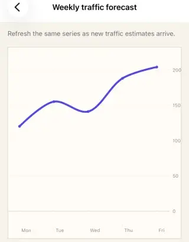

<p align="center">
  <picture>
    <source media="(prefers-color-scheme: dark)" srcset="docs/public/brand/nativephp-charts-lockup-dark.svg">
    
  </picture>
</p>

# NativePHP Charts

[](https://packagist.org/packages/donmanueldev/nativephp-charts)
[](https://github.com/donmanueldev/nativephp-charts/actions/workflows/ci.yml)
[](LICENSE.md)

**[Explore the documentation and native demos →](https://donmanueldev.github.io/nativephp-charts/)**

Start with [installation](https://donmanueldev.github.io/nativephp-charts/getting-started/installation/), choose from the chart guides beginning with [line](https://donmanueldev.github.io/nativephp-charts/charts/line/), then use the focused guides for [themes](https://donmanueldev.github.io/nativephp-charts/guides/themes/), [callbacks](https://donmanueldev.github.io/nativephp-charts/guides/callbacks-interactions/), and [troubleshooting](https://donmanueldev.github.io/nativephp-charts/guides/troubleshooting/).

Ten native chart types for [NativePHP Mobile](https://nativephp.com), including Cartesian, radial, progress, and contribution charts. iOS renders with Swift Charts and SwiftUI Canvas; Android renders with Jetpack Compose Canvas. Data stays on the device; there is no WebView, JavaScript chart library, network service, telemetry, or third-party native chart dependency.

> NativePHP Charts is an independent community plugin. It is not an official NativePHP package.

## Apps using NativePHP Charts

- [Despertá](https://desperta.momotombo.dev/) — [Get it on Google Play](https://play.google.com/store/apps/details?id=dev.momotombo.desperta)

## Documentation

- [Apps using NativePHP Charts](#apps-using-nativephp-charts)
- [Requirements](#requirements)
- [Installation](#installation)
- [Quick start](#quick-start)
- [Available chart types](#available-chart-types)
- [Chart examples](#chart-examples)
- [API guide](#api-guide)
- [Validation and quality](#validation-and-quality)
- [Platform and frontend scope](#platform-and-frontend-scope)
- [Support and security](#support-and-security)

## Requirements

| Requirement | Supported |
| --- | --- |
| PHP | `^8.4` |
| NativePHP Mobile | `^4.0` |
| Android | API 26 or newer |
| iOS | 18.2 or newer |
| NativePHP Desktop / WebView | Not supported |

## Installation

```bash
composer require donmanueldev/nativephp-charts:^1.0
php artisan vendor:publish --tag=nativephp-plugins-provider --no-interaction
php artisan native:plugin:register donmanueldev/nativephp-charts --no-interaction
php artisan native:plugin:list
php artisan native:plugin:validate
```

The chart renderers compile into the native shell. Rebuild the iOS or Android target after installing or updating the package.

## Quick start

Charts are leaf elements inside a NativePHP `NativeComponent` screen. The complete path to a first chart is a component class, a native route, and an EDGE Blade view.

Create `app/NativeComponents/SalesDashboard.php`:

```php
<?php

namespace App\NativeComponents;

use Illuminate\View\View;
use Native\Mobile\Edge\NativeComponent;

final class SalesDashboard extends NativeComponent
{
    public function render(): View
    {
        return view('native.sales-dashboard');
    }
}
```

Register the screen in your routes file:

```php
use App\NativeComponents\SalesDashboard;
use Illuminate\Support\Facades\Route;

Route::native('/', SalesDashboard::class);
```

Create `resources/views/native/sales-dashboard.blade.php`. Give the chart an explicit height and describe its purpose with `a11y-label`:

```blade
<native:column class="w-full h-full gap-4 p-4 safe-area">
    <native:text class="text-2xl font-bold">Ventas</native:text>

    <native:line-chart
        class="w-full h-80"
        :series="[[
            'id' => 'monthly-sales',
            'name' => 'Ventas',
            'color' => '#0F766E',
            'points' => [
                ['id' => 'sales-jan', 'label' => 'Ene', 'value' => 42000],
                ['id' => 'sales-feb', 'label' => 'Feb', 'value' => 51800],
                ['id' => 'sales-mar', 'label' => 'Mar', 'value' => 62400],
            ],
        ]]"
        locale="es-NI"
        value-format="currency"
        currency-code="NIO"
        :maximum-fraction-digits="0"
        a11y-label="Ventas mensuales en córdobas"
    />
</native:column>
```

The same `series` contract powers line, area, bar, and scatter charts. Every series needs a unique `id`, `name`, and ordered `points`; `color` is optional and otherwise comes from the active preset. Give every interactive point a stable `id` so selection survives updates and reordering.

<p align="center">
  
</p>

<p align="center"><sub>Native line chart rendered in the installed iOS app.</sub></p>

## Available chart types

| Chart | EDGE element | Data | Chart-specific option |
| --- | --- | --- | --- |
| Line | `<native:line-chart>` | Ordered `series` and `points` | Line and point styles |
| Area | `<native:area-chart>` | Ordered `series` and `points` | `area-mode="overlay|stacked"` |
| Bar | `<native:bar-chart>` | Ordered `series` and `points` | Grouped multi-series bars |
| Scatter | `<native:scatter-chart>` | Ordered `series` and numeric/date points | Numeric x-axis by default |
| Candlestick | `<native:candlestick-chart>` | One ordered OHLC series | Rising, falling, neutral, and wick styles |
| Radar | `<native:radar-chart>` | Ordered `axes`, `series`, and axis values | Grid levels and fill opacity |
| Pie | `<native:pie-chart>` | Ordered `segments` | Fixed inner radius of `0` |
| Donut | `<native:donut-chart>` | Ordered `segments` | `inner-radius-ratio` from `0.2` to `0.85` |
| Progress | `<native:progress-chart>` | Ordered `metrics` with values from `0` to `1` | Ring track, gap, cap, and center label styles |
| Contribution heatmap | `<native:contribution-heatmap>` | Unique ISO-dated `values` | Date window, week start, scale, and label visibility |

Every listed chart renders natively on iOS and Android and supports localized values, empty states, semantic styling, legends, selection callbacks, and accessible summaries.

## Chart examples

The following examples focus on the data and options that differ by chart. They use the same `NativeComponent` screen structure shown in the quick start.

### Area chart

Area charts support overlay and stacked multi-series fills.

```blade
<native:area-chart
    class="w-full h-80"
    :series="[
        [
            'id' => 'strength',
            'name' => 'Strength',
            'color' => '#2563EB',
            'points' => [
                ['id' => 'strength-mon', 'label' => 'Mon', 'value' => 42],
                ['id' => 'strength-tue', 'label' => 'Tue', 'value' => 51],
            ],
        ],
        [
            'id' => 'cardio',
            'name' => 'Cardio',
            'color' => '#F59E0B',
            'points' => [
                ['id' => 'cardio-mon', 'label' => 'Mon', 'value' => 28],
                ['id' => 'cardio-tue', 'label' => 'Tue', 'value' => 34],
            ],
        ],
    ]"
    area-mode="stacked"
    :legend="['visible' => true, 'position' => 'bottom']"
    a11y-label="Weekly training load by activity"
/>
```

### Bar chart

Bar charts render multiple series as grouped bars. Use matching ordered x values when the series are meant to be compared.

```blade
<native:bar-chart
    class="w-full h-72"
    :series="[
        [
            'id' => 'online',
            'name' => 'Online',
            'color' => '#7C3AED',
            'points' => [
                ['id' => 'online-q1', 'label' => 'Q1', 'value' => 42000],
                ['id' => 'online-q2', 'label' => 'Q2', 'value' => 51800],
            ],
        ],
        [
            'id' => 'store',
            'name' => 'Store',
            'color' => '#0F766E',
            'points' => [
                ['id' => 'store-q1', 'label' => 'Q1', 'value' => 31000],
                ['id' => 'store-q2', 'label' => 'Q2', 'value' => 38600],
            ],
        ],
    ]"
    :legend="['visible' => true, 'position' => 'top']"
    :y-axis="[
        'valueFormat' => 'currency',
        'currencyCode' => 'USD',
        'maximumFractionDigits' => 0,
    ]"
    _select="pointSelected"
    a11y-label="Quarterly revenue by channel"
/>
```

### Scatter chart

Scatter points preserve the real spacing of numeric, date, or datetime x values. Unlike line and area charts, scatter defaults to a numeric x-axis.

```blade
<native:scatter-chart
    class="w-full h-80"
    :series="[[
        'id' => 'control',
        'name' => 'Control',
        'color' => '#2563EB',
        'points' => [
            ['id' => 'control-1', 'x' => 1.2, 'label' => 'Observation 1', 'value' => 0.34],
            ['id' => 'control-2', 'x' => 2.8, 'label' => 'Observation 2', 'value' => 0.47],
        ],
    ]]"
    :x-axis="['type' => 'number', 'labelCount' => 5]"
    :y-axis="['valueFormat' => 'percent', 'maximumFractionDigits' => 0]"
    _select="pointSelected"
    a11y-label="Conversion observations for the control cohort"
/>
```

Percentage values are fractions: `0.47` renders as `47%`.

### Candlestick chart

Candlestick charts accept one ordered series. Every point defines `open`, `high`, `low`, and `close`; the high-low range must contain the candle body. Use a date or datetime x-axis for market data.

```blade
<native:candlestick-chart
    class="w-full h-80"
    :series="[[
        'id' => 'nio-usd',
        'name' => 'NIO/USD',
        'color' => '#2563EB',
        'points' => [
            [
                'id' => '2026-08-28',
                'label' => '28 Aug',
                'x' => '2026-08-28',
                'open' => 36.72,
                'high' => 36.91,
                'low' => 36.68,
                'close' => 36.84,
            ],
            [
                'id' => '2026-08-29',
                'label' => '29 Aug',
                'x' => '2026-08-29',
                'open' => 36.84,
                'high' => 36.88,
                'low' => 36.70,
                'close' => 36.76,
            ],
        ],
    ]]"
    :x-axis="['type' => 'date', 'dateFormat' => 'medium']"
    :style="['candlestick' => [
        'risingColor' => '#15803D',
        'fallingColor' => '#B91C1C',
        'neutralColor' => '#64748B',
        'wickWidth' => 2,
    ]]"
    _select="pointSelected"
    a11y-label="Daily NIO to USD exchange rate"
/>
```

### Radar chart

Radar charts require 3 to 24 ordered axes. Each series must provide exactly one value per axis, in the same order, and every value must be between zero and that axis's maximum.

```blade
<native:radar-chart
    class="w-full h-80"
    :axes="[
        ['id' => 'speed', 'label' => 'Speed', 'maximum' => 100],
        ['id' => 'quality', 'label' => 'Quality', 'maximum' => 100],
        ['id' => 'cost', 'label' => 'Cost', 'maximum' => 100],
    ]"
    :series="[[
        'id' => 'nativephp',
        'name' => 'NativePHP',
        'color' => '#6366F1',
        'values' => [
            ['axis' => 'speed', 'value' => 88],
            ['axis' => 'quality', 'value' => 92],
            ['axis' => 'cost', 'value' => 74],
        ],
    ]]"
    :grid-levels="4"
    :fill-opacity="0.3"
    :legend="['visible' => true, 'position' => 'bottom']"
    _select="pointSelected"
    a11y-label="NativePHP capability profile"
/>
```

### Pie and donut charts

Pie and donut charts use ordered `segments`. Every segment needs a unique `id`, a `label`, and a non-negative finite `value`; `color` is optional. A non-empty chart must contain at least one positive value.

```blade
<native:pie-chart
    class="w-full h-72"
    :segments="[
        ['id' => 'music', 'label' => 'Music', 'value' => 58, 'color' => '#7C3AED'],
        ['id' => 'podcasts', 'label' => 'Podcasts', 'value' => 27, 'color' => '#2563EB'],
        ['id' => 'audiobooks', 'label' => 'Audiobooks', 'value' => 15, 'color' => '#F59E0B'],
    ]"
    :legend="['visible' => true, 'position' => 'bottom']"
    _select="pointSelected"
    a11y-label="Listening time by format"
/>
```

```blade
<native:donut-chart
    class="w-full h-72"
    :segments="[
        ['id' => 'subscriptions', 'label' => 'Subscriptions', 'value' => 48200, 'color' => '#2563EB'],
        ['id' => 'services', 'label' => 'Services', 'value' => 31750, 'color' => '#7C3AED'],
        ['id' => 'partners', 'label' => 'Partners', 'value' => 9650, 'color' => '#F59E0B'],
    ]"
    :inner-radius-ratio="0.62"
    :legend="['visible' => true, 'position' => 'bottom']"
    :style="['segment' => ['gap' => 2, 'cornerRadius' => 7, 'opacity' => 0.96]]"
    value-format="currency"
    currency-code="USD"
    :maximum-fraction-digits="0"
    _select="pointSelected"
    a11y-label="Quarterly revenue by channel"
/>
```

Pie fixes the inner radius at `0`. Donut defaults to `0.6` and accepts `0.2` through `0.85`.

### Progress and contribution heatmap

Progress values are strict fractions from `0` to `1`. Contribution values use unique ISO dates and non-negative values.

```blade
<native:progress-chart
    class="w-full h-72"
    :metrics="[
        ['id' => 'delivery', 'label' => 'Delivery', 'value' => 0.82],
        ['id' => 'quality', 'label' => 'Quality', 'value' => 0.94],
    ]"
    center-label="This sprint"
    preset="spectrum"
    :legend="['visible' => true]"
    _select="metricSelected"
    a11y-label="Sprint goals"
/>

<native:contribution-heatmap
    class="w-full h-64"
    :values="[
        ['id' => '2026-09-15', 'date' => '2026-09-15', 'value' => 3, 'label' => '3 commits'],
        ['id' => '2026-09-16', 'date' => '2026-09-16', 'value' => 7, 'label' => '7 commits'],
    ]"
    end-date="2026-09-30"
    :days="180"
    :week-starts-on="1"
    _select="daySelected"
    a11y-label="Repository contributions"
/>
```

## API guide

Use this section after the first chart renders to add interaction, formatting, legends, and semantic styling.

### Themes and presets

Every chart accepts `theme="light|dark|system"`, `preset`, and `error-label`. Built-in presets are `default`, `spectrum`, and `contrast`. Publish the package config to register application presets:

```bash
php artisan vendor:publish --tag=nativephp-charts-config
```

Resolution is deterministic: built-in preset, application preset override, chart theme/style, then explicit series, segment, or metric color. The API stays renderer-neutral; it exposes no SwiftUI or Compose primitives.

### Selection and PHP callbacks

Bind `_select` to a public method on the surrounding `NativeComponent`. Native selection and tooltips update immediately; the PHP callback receives the selected identity and value as JSON.

```php
use Donmanueldev\NativephpCharts\PointSelection;

public ?string $selectedPointId = null;

public function pointSelected(string $payload): void
{
    $selection = PointSelection::fromJson($payload);

    $this->selectedPointId = $selection->pointId;
}
```

The fluent element API uses `->onSelect('pointSelected')`. Callback payload version 1 contains:

```json
{
  "version": 1,
  "chart_type": "bar",
  "series_id": "online",
  "series_name": "Online",
  "point_id": "online-q1",
  "point_index": 0,
  "x_type": "category",
  "x": "Q1",
  "label": "Q1",
  "value": 42000,
  "localized_value": "$42,000"
}
```

Treat `localized_value` as presentation text. Use `value`, IDs, and `x` for application logic.

### Axes and formatting

Cartesian charts accept structured `x-axis` and `y-axis` maps. Scalar formatting props remain supported; a structured y-axis value overrides the corresponding scalar value.

```blade
<native:line-chart
    class="w-full h-80"
    :series="$balanceSeries"
    :x-axis="[
        'type' => 'date',
        'dateFormat' => 'medium',
        'timezone' => 'America/Managua',
    ]"
    :y-axis="[
        'valueFormat' => 'currency',
        'currencyCode' => 'NIO',
        'maximumFractionDigits' => 2,
    ]"
    locale="es-NI"
    a11y-label="Account balance over time"
/>
```

| X-axis type | Point `x` value |
| --- | --- |
| `category` | Optional string; defaults to `label` |
| `number` | Finite integer or float |
| `date` | Strict `YYYY-MM-DD` |
| `datetime` | RFC 3339 with `Z` or an explicit offset |

`x-axis` accepts `type`, `title`, `minimum`, `maximum`, `baseline`, `interval`, `dateFormat`, `timezone`, `visible`, and `labelCount`. `y-axis` accepts `title`, `minimum`, `maximum`, `baseline`, `interval`, `valueFormat`, `currencyCode`, `minimumFractionDigits`, `maximumFractionDigits`, `visible`, `labelCount`, and `beginAtZero`.

Date formats are `short`, `medium`, `long`, and `full`; datetime axes also accept `time`. Timezones use IANA identifiers such as `America/Managua`. Currency uses a three-letter code such as `USD` or `NIO`. Axis `labelCount` must be between 2 and 12.

### Legends and styles

`legend` accepts `visible` (`true`, `false`, or automatic when omitted), `position` (`top`, `bottom`, `leading`, or `trailing`), `alignment` (`start`, `center`, or `end`), and a nested `style` map.

```blade
:legend="[
    'visible' => true,
    'position' => 'bottom',
    'alignment' => 'center',
    'style' => [
        'font' => 'accent',
        'fontSize' => 12,
        'labelColor' => '#475569',
        'markerSize' => 9,
    ],
]"
```

The platform-neutral `style` map supports:

- `line`: `color`, `width`, `interpolation` (`linear`, `smooth`, `step_before`, `step_after`), and an even-length `dash` list.
- `area`: `opacity` and `gradient`.
- `bar`: `radius` and optional `width`.
- `candlestick`: `risingColor`, `fallingColor`, `neutralColor`, and `wickWidth`.
- `points`: `visible`, `color`, and `size`.
- `grid`: `visible`, `color`, and `width`.
- `axis`: `visible`, `color`, `labelColor`, `font`, `fontSize`, and `labelCount`.
- `segment`: `gap`, `cornerRadius`, and `opacity` for pie and donut charts.

Colors accept `#RGB`, `#RRGGBB`, CSS-alpha `#RRGGBBAA`, `black`, `white`, and `transparent`. Axis and legend fonts accept bundled NativePHP font tokens or configured aliases and fall back to the system font when unresolved.

### Public properties

| Blade property | Default | Applies to | Description |
| --- | --- | --- | --- |
| `series` | `[]` | Cartesian, radar | Ordered series containing points or radar axis values. |
| `segments` | `[]` | Pie, donut | Ordered, uniquely identified radial segments. |
| `axes` | `[]` | Radar | Ordered axis definitions with unique IDs, labels, and positive maximums. |
| `show-grid` | `true` | Cartesian | Shows chart grid lines. |
| `show-points` | `true` | Line, area; legacy bar fallback | Shows point symbols; on bars it preserves the legacy axis fallback. |
| `begin-at-zero` | `true` | Line, bar | Includes zero in the y domain. Area retains zero as its fill baseline. |
| `animated` | `true` | All | Enables native reveal and update animation. |
| `empty-label` | `No data` | All | Visible and accessible empty state. |
| `a11y-label` | `Chart` | All | Purpose announced by assistive technology. Supply an application-specific label. |
| `locale` | Device locale | All | BCP-47 locale such as `es-NI` or `en-US`. |
| `value-format` | `number` | All | `number`, `currency`, or `percent`. |
| `currency-code` | None | All | Required three-letter code when the value format is currency. |
| `minimum-fraction-digits` | Formatter default | All | Integer from 0 to 8. |
| `maximum-fraction-digits` | Formatter default | All | Integer from 0 to 8. |
| `x-axis` | Category; number for scatter | Cartesian | Structured x-axis configuration. |
| `y-axis` | Scalar formatter props | Cartesian | Structured y-axis and value formatting. |
| `legend` | Visible for multiple items | All | Visibility, position, alignment, and semantic style. |
| `_select` | None | All | PHP method receiving selection JSON. |
| `style` | `[]` | All | Chart-specific, platform-neutral visual configuration. |
| `area-mode` | `overlay` | Area | `overlay` or `stacked`. |
| `inner-radius-ratio` | `0.6` | Donut | Cutout ratio from `0.2` through `0.85`. |
| `grid-levels` | `5` | Radar | Polygon grid level count from 2 through 10. |
| `fill-opacity` | `0.22` | Radar | Series fill opacity from 0 through 1. |

Blade uses kebab case. The fluent PHP API uses camelCase methods such as `series()`, `segments()`, `axes()`, `showGrid()`, `xAxis()`, `yAxis()`, `legend()`, `style()`, `onSelect()`, `areaMode()`, `innerRadiusRatio()`, `gridLevels()`, and `fillOpacity()`.

## Validation and quality

### Validation rules

- Collections must be ordered PHP lists, not associative maps.
- Series IDs must be unique within a chart; point IDs must be unique within their series.
- Numeric values must be finite. Exact cross-platform integers are limited to `±9,007,199,254,740,991`.
- Segment values must be non-negative, and a populated pie or donut needs at least one positive segment.
- Candlestick points require finite OHLC values and a valid high-low range; only one series is accepted.
- Radar charts require 3 to 24 ordered axes and one in-range value per axis for every series.
- `minimumFractionDigits` cannot exceed `maximumFractionDigits`; each accepts 0 through 8.
- Explicit axis minimums must not exceed maximums. Intervals must be positive.
- Category x-axes do not accept an explicit numeric/date domain.
- Unknown axis, legend, style, series, point, and segment options are rejected instead of silently ignored.

### Accessibility

- Always provide a localized `a11y-label` describing the chart's purpose.
- Use stable IDs so selection remains deterministic across updates and reordering.
- Native renderers bound large accessibility summaries instead of reading an unbounded dataset.
- Validate realistic and worst-case datasets on every target device.

### Testing

```bash
composer test
swift test
```

PHP tests cover normalization, serialization, compatibility, and callback registration. Swift tests cover the iOS renderer source.


## Platform and frontend scope

This is a SuperNative EDGE UI component package. It intentionally has no JavaScript API, bridge functions, permissions, secrets, Livewire WebView integration, or Inertia wrapper. NativePHP Desktop, Electron, browser rendering, and Chart.js are outside scope.

## Support and security

Use [GitHub Issues](https://github.com/donmanueldev/nativephp-charts/issues) for reproducible bugs and feature requests. Follow [SECURITY.md](SECURITY.md) for private vulnerability reports.

## License

NativePHP Charts is open-source software licensed under the [MIT license](LICENSE.md).
